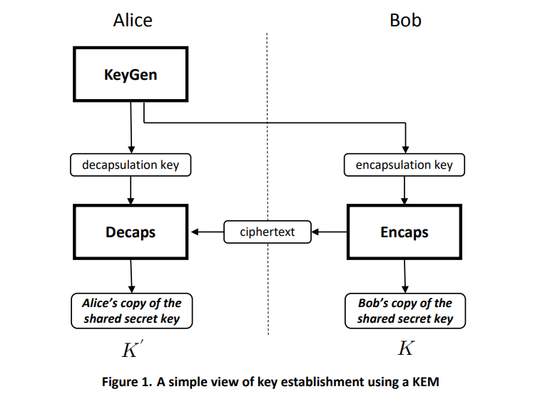

## Python AEAD encryption using Post Quantum Cryptography (ML-KEM)

This is a simple python library and cli using `ML-KEM` to wrap encrypt/decrypt arbitrary data.  

This is basically hybrid encryption where an `ML-KEM` keypair's public key is used to generate a `sharedSecret` which afer a key derivation is used as an `AES-GCM` encryption key ultimately used to encrypt the data.

This library also supports [Google Cloud KMS](https://cloud.google.com/blog/products/identity-security/announcing-quantum-safe-key-encapsulation-mechanisms-in-cloud-kms)  `ML-KEM`

>> NOTE: this library is note supported by Google and is experimental/unreviewed (caveat emptor)

Also see:

* [NIST Post-Quantum Cryptography Project](https://csrc.nist.gov/Projects/Post-Quantum-Cryptography)
* [crypto: post-quantum support roadmap](https://github.com/golang/go/issues/64537)
* Key Encapsulation [ML-KEM](https://csrc.nist.gov/pubs/fips/203/final)
* [Internet X.509 Public Key Infrastructure - Algorithm Identifiers for the Module-Lattice-Based Key-Encapsulation Mechanism (ML-KEM)](https://datatracker.ietf.org/doc/draft-ietf-lamps-kyber-certificates/08/)
* [Post-Quantum Cryptography (PQC) scratchpad](https://github.com/salrashid123/pqc_scratchpad)

* [go-pqc-wrapping](https://github.com/salrashid123/go-pqc-wrapping)
* [Post-Quantum Cryptography (PQC) scratchpad](https://github.com/salrashid123/pqc_scratchpad)
* [golang-jwt for post quantum cryptography](https://github.com/salrashid123/golang-jwt-pqc)

This library currently use  [liboqs-python](https://github.com/open-quantum-safe/liboqs-python) which itself has a dependency on C and installation of `liboqs.so`.  Eventually, when there's a pure-python implementation of mlkem, i'll use that instead. see [pyca/cryptography/issues/12824](https://github.com/pyca/cryptography/issues/12824).

Please note later on the keyFormat would adopt [rfc9629](https://datatracker.ietf.org/doc/rfc9629/) if/when officially approved.

### QuickStart

Using docker image from [example/Dockerfile](example/Dockerfile)

```bash
docker run -v /dev/urandom:/dev/urandom -ti salrashid123/openssl-liboqs-python
```

then within the container

```bash
git clone https://github.com/salrashid123/python_pqc_wrapping.git
cd python_pqc_wrapping/example/

virtualenv env
source env/bin/activate
pip3 install  python-pqc-wrapping

# encrypt
python3 encrypt.py

# decrypt   
python3 decrypt.py

### to print key details
openssl pkey -in certs/bare-seed-768.pem -text
openssl asn1parse -inform PEM -in certs/bare-seed-768.pem
openssl asn1parse -inform PEM -in certs/pub-ml-kem-768-bare-seed.pem
```

### Setup

First install [liboqs-python](https://github.com/open-quantum-safe/liboqs-python)

```bash
apt install astyle cmake gcc ninja-build libssl-dev python3-pytest python3-pytest-xdist unzip xsltproc doxygen graphviz python3-yaml valgrind git

git clone --depth=1 https://github.com/open-quantum-safe/liboqs

cmake -S liboqs -B liboqs/build  -DBUILD_SHARED_LIBS=ON 
cmake --build liboqs/build --parallel 8
cmake --build liboqs/build --target install

# if you want a different installation directory (eg /apps/liboqs), 
### add -DCMAKE_INSTALL_PREFIX=/apps/liboqs  to the configure command above.
### when running the samples, set the env var  
### export OQS_INSTALL_PATH=/apps/liboqs
```

also on  

* [https://pypi.org/project/python-pqc-wrapping](https://pypi.org/project/python-pqc-wrapping)
* [https://test.pypi.org/project/python-pqc-wrapping](https://test.pypi.org/project/python-pqc-wrapping)


if you alreeady have `liboqs` installed, 

```bash
export OQS_INSTALL_PATH=/path/to/liboqs
pip install python-pqc-wrapping
```

---

* [Usage](#usage)
  - [Key Generation](#key-generation)
  - [Library](#library)
    - [Encrypt](#encrypt)
    - [Decrypt](#decrypt)
* [Wrapped Key format](#wrapped-key-format)
  - [Client Data](#client-data)
  - [Versions](#versions)
* [GCP KMS](#gcp-kms)
* [Build](#build)
* [Openssl key formats](#openssl-key-formats)
* [References](#references)

---

## Usage

If you want to encrypt data intended for a remote system, the remote system must first generate an `ML-KEM` key pair and share the public key

If Bob wants to encrypt data for Alice

1. Alice generates `MK-KEM` keypair (`pub.pem`, `priv.pem`)

2. Alice shares public key `pub.pem` with Bob

Encrypt (Bob):

3. generate encapsulation data using `pub.pem`
   
   `kemSharedSecret, kemCipherText = ML_KEM_Encapsulate( pub.pem )` 

4. Derive a new key using `kemSharedSecret` to AEAD key to encrypt `plainText`

   `derivedKey = HKDF( kemSharedSecret )`
   
   `cipherText = AEAD_Encrypt( derivedKey, plainText )`

5.  Bob sends `[ kemCipherText, cipherText ]` to Alice

Decrypt (Alice):

6. derive same shared secret using private key `priv.pem`

   `kemSharedSecret = ML_KEM_Decapsulate( priv.pem, kemCipherText )`

7. `derivedKey = HKDF( kemSharedSecret )`

8. `plaintext = AEAD_Decrypt( derivedKey, cipherText )`

This extends how ml-kem is used by employing the `kemSharedSecret` as a wrapping AES256-GCM encryptionKey.  For reference, the basic flow is described here in [FIPS 203 (page 12)](https://nvlpubs.nist.gov/nistpubs/FIPS/NIST.FIPS.203.pdf)



### Key Generation

This repo only support PEM encoded files which encodes the `bare-seed`.  See the [#openssl-key-formats](#openssl-key-formats) section below.

The PEM file itself is described in [draft-ietf-lamps-kyber-certificates-11](https://datatracker.ietf.org/doc/draft-ietf-lamps-kyber-certificates/11/) where just the `seed` is required (see seciton `C.1.2.1.  Seed Format`)

To generate a key, simply openssl 3.5.0+ which you can get in a dockerfile format at [Post-Quantum Cryptography (PQC) scratchpad](https://github.com/salrashid123/pqc_scratchpad).

or with openssl

```bash
$ openssl -version
    OpenSSL 3.5.0-dev  (Library: OpenSSL 3.5.0-dev )

### generate ML-KEM-768
$ openssl genpkey  -algorithm mlkem768 \
   -provparam ml-kem.output_formats=bare-seed \
   -out priv-ml-kem-768-bare-seed.pem

openssl pkey  -in priv-ml-kem-768-bare-seed.pem  -pubout -out pub-ml-kem-768-bare-seed.pem
```

If your openssl version does not support mlkem, you can use a dockerfile

```bash
docker run -v /dev/urandom:/dev/urandom -ti salrashid123/openssl-pqs:3.5.0-dev
```

The `example/util` folder contains two samples

* [example/util/to_pem.py](example/util/to_pem.py)

   this generates a key from a known seed and create the public and private PEM key files.  Just comment out the static seed to create new keys.

* [example/util/from_pem.py](example/util/from_pem.py)

   this reads a PEM public and private key and creates an mlkem client and server


if you want ot use go, see [this example](https://github.com/salrashid123/go-pqc-wrapping/blob/main/README.md#key-generation) 

### Library

#### Encrypt

To encrypt, you need to provide the PEM format of the ML-KEM public key:

```python
from python_pqc_wrapping import BaseWrapper

public_key_file_path= 'certs/pub-ml-kem-768-bare-seed.pem'
with open(public_key_file_path, 'r') as f:
    public_key_string = f.read()

client_data = '{"foo":"bar"}'
be = BaseWrapper(publicKey=public_key_string,keyName="mykey", clientData=client_data)

en = be.encrypt(plaintext=b'foo', aad=b'myaad')
print(en)
```

#### Decrypt

To decrypt, you need to provide the PEM `bare-seed` format of the public key.

```python
from python_pqc_wrapping import BaseWrapper

private_key_file_path= 'certs/bare-seed-768.pem'
with open(private_key_file_path, 'r') as f:
    private_key_string = f.read()

with open("/tmp/encrypted.json", 'r') as file:
    encrypted_data = file.read()

client_data = '{"foo":"bar"}'
bd = BaseWrapper(privateKey=private_key_string, clientData=client_data)

dn = bd.decrypt(blob_info=encrypted_data, aad=b'myaad')
print(dn)
```

see `example/` folder:

#### Client Data

You can also embed additional arbitrary JSON data into the protobuf as `client_data` structure.  This data is **not** included in the encryption and is not directly related to the `AdditionalData (AAD)` associated with aes-gcm.

The client data field is instead just unencrypted/unverified data you can associate with the encoded key.  

However, you can canonicalize the `client_data` as JSON, hash that and use that hash value as the AAD.  In effect, the client_data can then be used as part of the integrity calculation.

For example, if the client data is

```json
	"clientData": {
		"location": {
			"region": "us",
			"zone": "central"
		},
		"provider": "pqc"
	}
```

Note that you can specify the client data either in the overall wrapper config or during each encrypt/decrypt method.  TODO: If specified in the encrypt/decrypt methods, it takes priority.

### GCP KMS

This library also supports encapsulation using [GCP KMS MLKEM](https://docs.cloud.google.com/kms/docs/key-encapsulation-mechanisms) 

To use this mode, first create a kms key

```bash
gcloud kms keyrings create kem_kr --location=global

gcloud kms keys create kem_key_1 \
    --keyring kem_kr \
    --location global \
    --purpose "key-encapsulation" \
    --default-algorithm ml-kem-768 \
    --protection-level "software"


gcloud kms keys versions get-public-key 1 \
    --key kem_key_1 \
    --keyring kem_kr \
    --location global  \
    --output-file /tmp/kem_pub.nist \
    --public-key-format nist-pqc
```

The extract the public key into PEM format:

```bash
$ openssl --version
  OpenSSL 3.5.0-dev  (Library: OpenSSL 3.5.0-dev )

### for ML-KEM-768
$ { echo -n "MIIEsjALBglghkgBZQMEBAIDggShAA==" | base64 -d ; cat /tmp/kem_pub.nist; } | openssl asn1parse -inform DER -in -
    0:d=0  hl=4 l=1202 cons: SEQUENCE          
    4:d=1  hl=2 l=  11 cons: SEQUENCE          
    6:d=2  hl=2 l=   9 prim: OBJECT            :ML-KEM-768
   17:d=1  hl=4 l=1185 prim: BIT STRING        

$ cd example/
$ { echo -n "MIIEsjALBglghkgBZQMEBAIDggShAA==" | base64 -d ; cat /tmp/kem_pub.nist; } \
   | openssl pkey -inform DER -pubin -pubout -out certs/pub-ml-kem-768-kms.pem
```

then if your environment is authorized to access the key (eg, `GOOGLE_APPLICATION_CREDENTIALS` service account below has access to the key above).

The uri you will specify to decrypt is set with the kms uri prefixed with `gcpkms://`.  For example

```python
private_key_file_path= 'gcpkms://projects/core-eso/locations/global/keyRings/kem_kr/cryptoKeys/kem_key_1/cryptoKeyVersions/1'

bd = BaseWrapper(privateKey=private_key_file_path, clientData=client_data, decrypt=True)
```

### Wrapped Key format

There are two levels of encryption involved with this library and is best described in this flow:

TODO: Reformat proto to use `KEMRecipientInfo`:  [Using Key Encapsulation Mechanism (KEM) Algorithms in the Cryptographic Message Syntax (CMS)](https://datatracker.ietf.org/doc/rfc9629/), [A PQC Almanac](https://downloads.bouncycastle.org/csharp/docs/PQC-Almanac.pdf)

-  Encrypt

1. Read the `ML-KEM` Public key and generate `sharedCiphertext` and `sharedSecret`

   ```python
      sharedCiphertext, shared_secret_server = server.encap_secret(public_key_bytes)
   ```

2. Create new *direct* `aes-gcm` client but first derive a new key from `shared_secret_server` and then use that as the key. Finally, prepend the nonce/iv to the [iv into the ciphertext](https://github.com/hashicorp/go-kms-wrapping/blob/main/aead/aead.go#L242-L249) 

   ```python
      derived_key = KDF(shared_secret_server)         
      aesgcm = AESGCM(derived_key)
      nonce = os.urandom(self.DEFAULT_IV_SIZE)
      ciphertext = nonce + aesgcm.encrypt(nonce, plaintext, aad)
   ```

* `ciphertext`: the encrypted data wrapped using `kemSharedSecret`  amd already includes the initialization vector
* `wrappedKey`: the ML-KEM `sharedCiphertext`

```json
{
  "ciphertext": "TdCcswd2btZN4DjioUVZU33lK4YyAq/PltA18M4nQA==",
  "keyInfo": {
    "mechanism": "1",
    "keyId": "mykey",
    "wrappedKey": "ewoibmFtZSI6ICJteWtleSIsCiJ2ZXJzaW9uIjogMiwKInR5cGUiOiAibWxfa2VtXzc2OCIsCiJrZW1DaXBoZXJUZXh0IjogIk1mTW00ZG00bjZKU3pFbjJCSmZ1QXJIRndkMmxTU0JHVGFiMGhkTFZpNEhYSXN6MlVwSlVUUXE0WUpKUVpiZTFtOUpqZzlqbXpidForZklhbEJvQWpFa0lMNGRkemN2UTJWK2pxM0FKSGpLRTNZWTl0V3kxbjRTWmhTYm9SMy9scmRwd29Odm9FemRKWGhOdHZVMDJDVktYRDFpdFpwaGsrT0dNV1hSNWJUTmtpeHZQellwbTdaTmpmWTZhSzZRUG5DNmZtby9DMkdTQSswL2VRdDhOeXVHQ25TMUhJVFVDSDVvQjZrL2FzdTkxYmNuSHpKMzY2cjNuSEdROGRJSkphYlpoa1JsanN0YTJHZXd0VzNENzE2MzhqVUZyT1h1ZUpmRENQbEQwRmRHeU1zZm1TTDlEdHVWZ1RmdVNkNUJJU3RqN1lJUHRGK2RBQmNoR0FvZmM0dXZvNStzdXNNWXAxZEhjM1ZaVzMrcVF4Z1pIM1J2bTg3b0hSUXhZVGs4cmt4SkRJcktIUkxTc2tUR2JlYU4zSmFwZ3FtQmJndmV2MVd4Zy9mdmdyWkRlWlBrelI4T29Jd29UVWRzc0NUUDV4MTRvYVZkbk9iVmdGLytyOUVYRklhVklUb1J1Ri9XNWE5Q0lsSzlES2JoK21vb2pmSVpyd2F6amlIR2FpM0R5VkdqSFJUU0RBeDZyNmZPcnlJUFh5QXpRMVhseFBsa2gyZjlVMGw1RTNqdlhEMUJMSGtUM1o1WUl2VENVNDNXTjBNVkRSb01PemhoNy9zWGp6RENwY1B1dkpjemVjQ2hCNWNFQXJYV2JDR2RIc2ZtTWNEeGRSZ0lRUDUyS1FvS0VqaEtQNUhVb1BFWU5GOFdSNy9DbVEydXV6U2I1K0RteEcrODJHSk9IUW5oa1dMajRlYXYvcXJ0YmlsdFZjbURzaFR6eXBXVnlZV2Y2cWZLc3BJU0p1c3RYWjJKbURwVmNDN3c2UndhQ3BsTzVtME5qdHFqdmdDZTVtcjQrNnh0S3p6OHJJek1PalhielI4ZEdsaHpKWkxTZGhJQTl3eHRJa0pQUGxuYUw3QzY2NGVob3l4WGRsRElxdVFCdXNONHJsZmNoVDloZnQvODhkMjlLajM1cE84Nkg3bzhZbThWcEZSVmRJMU1SNENqKzZ6MURFdmpLVnk2c1FJVGl5M21ZeUxqZ1orcUZEMWVsL3M4VjBHUWl0bHpBeEMyY3c2bDVKckJYUzk3M2Y0VGJPdGd6V0lyZmcxNFhNRTJhb3NIL2pTaktkdFRVVEZzKzlpY0Q1cnA5ZmNjNC92aS9NajFzZW5YNFhqbDFEUTBuSGRQd29oK2pzQVZaem8vMnpJNXcwTng0dGpFeEU5TVJtVnRkSFV3bDk1QmxvYmt5djZGcmJBRDJlQ0I1SzhoRU5OSzc2QTBubE5NT2NtMlFpeVBLNGZCZVBTZytsb2tMeDh2aG5EeTRSaENkN3JtS1dpMytiUkFjMTNnTndxZG9HS0RVSkVPRVU5azJBM2pNdkxQNVE4ZE0rQzhZckp6eGJzNFJvUVdYWkp6emhyWGdPbUlJWHJOTG9XMjN2NTNTdWEyeWFpRVdPaCtXS2dtOVN2ZWRlR3NscWFSL01iUzVhVXBrNUJaa29Uc1VGWUFka3pnQi9XdENETGlQOW9RZEh3Q1RHTWZ5YmE1THJyRmsyczBzRDgrZjNBcm5veWJyM24xQzRBL29DbUZ3SXJKaTF2OUI0eTVBbHIzdEVaUHdQL0FxQllxZnNzcXVKOFFwOC8rVUUzc0UrVmMrdkVpVEhNUjlzTVMwL1VYMlRySlBaK05WVHVFTTdRZnQzQktoS2NPQVNvWlFIQlo3bXpoQWV2SllFeGtKaFR1Qm9kb1BUSTRWbzFPVE5wZW0zTjd6OEpmOFh5amFTbVB0d3JzPSIsCiJrZGZTYWx0IjogIlcyc3R0ZC8vdmozWUtnWWMiCn0="
  },
  "clientData": {
    "foo": "bar"
  }
}
```

If you base64decode the `wrappedKey`

* `kemCipherText` the `ML-KEM` ciphertext (eg `sharedCiphertext`). Once this is decapsulated, this becomes an AES GCM after KDF

The decoded keyfile is:

```json
{
  "name": "mykey",
  "version": 2,
  "type": "ml_kem_768",
  "kemCipherText": "MfMm4dm4n6JSzEn2BJfuArHFwd2lSSBGTab0hdLVi4HXIsz2UpJUTQq4YJJQZbe1m9Jjg9jmzbtZ+fIalBoAjEkIL4ddzcvQ2V+jq3AJHjKE3YY9tWy1n4SZhSboR3/lrdpwoNvoEzdJXhNtvU02CVKXD1itZphk+OGMWXR5bTNkixvPzYpm7ZNjfY6aK6QPnC6fmo/C2GSA+0/eQt8NyuGCnS1HITUCH5oB6k/asu91bcnHzJ366r3nHGQ8dIJJabZhkRljsta2GewtW3D71638jUFrOXueJfDCPlD0FdGyMsfmSL9DtuVgTfuSd5BIStj7YIPtF+dABchGAofc4uvo5+susMYp1dHc3VZW3+qQxgZH3Rvm87oHRQxYTk8rkxJDIrKHRLSskTGbeaN3JapgqmBbgvev1Wxg/fvgrZDeZPkzR8OoIwoTUdssCTP5x14oaVdnObVgF/+r9EXFIaVIToRuF/W5a9CIlK9DKbh+moojfIZrwazjiHGai3DyVGjHRTSDAx6r6fOryIPXyAzQ1XlxPlkh2f9U0l5E3jvXD1BLHkT3Z5YIvTCU43WN0MVDRoMOzhh7/sXjzDCpcPuvJczecChB5cEArXWbCGdHsfmMcDxdRgIQP52KQoKEjhKP5HUoPEYNF8WR7/CmQ2uuzSb5+DmxG+82GJOHQnhkWLj4eav/qrtbiltVcmDshTzypWVyYWf6qfKspISJustXZ2JmDpVcC7w6RwaCplO5m0NjtqjvgCe5mr4+6xtKzz8rIzMOjXbzR8dGlhzJZLSdhIA9wxtIkJPPlnaL7C664ehoyxXdlDIquQBusN4rlfchT9hft/88d29Kj35pO86H7o8Ym8VpFRVdI1MR4Cj+6z1DEvjKVy6sQITiy3mYyLjgZ+qFD1el/s8V0GQitlzAxC2cw6l5JrBXS973f4TbOtgzWIrfg14XME2aosH/jSjKdtTUTFs+9icD5rp9fcc4/vi/Mj1senX4Xjl1DQ0nHdPwoh+jsAVZzo/2zI5w0Nx4tjExE9MRmVtdHUwl95Blobkyv6FrbAD2eCB5K8hENNK76A0nlNMOcm2QiyPK4fBePSg+lokLx8vhnDy4RhCd7rmKWi3+bRAc13gNwqdoGKDUJEOEU9k2A3jMvLP5Q8dM+C8YrJzxbs4RoQWXZJzzhrXgOmIIXrNLoW23v53Sua2yaiEWOh+WKgm9SvedeGslqaR/MbS5aUpk5BZkoTsUFYAdkzgB/WtCDLiP9oQdHwCTGMfyba5LrrFk2s0sD8+f3Arnoybr3n1C4A/oCmFwIrJi1v9B4y5Alr3tEZPwP/AqBYqfssquJ8Qp8/+UE3sE+Vc+vEiTHMR9sMS0/UX2TrJPZ+NVTuEM7Qft3BKhKcOASoZQHBZ7mzhAevJYExkJhTuBodoPTI4Vo1OTNpem3N7z8Jf8XyjaSmPtwrs=",
  "kdfSalt": "W2sttd//vj3YKgYc"
}
```

If you want to use cli to decode everything run

```bash
$ cat /tmp/encrypted.json  | jq -r '.'
$ cat /tmp/encrypted.json  | jq -r '.keyInfo.wrappedKey' | base64 -d - | jq -r '.'
```

#### Versions

The following lists the Version values used in the encoding of the key.

Its important to decrypt using a cli or library version which is consistent with the proto or key encoding formats.

| KeyVersion | Date |
|------------|-------------|
| 2 | `1/2/26` |
| 3 | `1/7/26` |

### Build

If you want to regenerate with protoc:

```bash
$ /usr/local/bin/protoc --version
   libprotoc 25.1


$ /usr/bin/protoc --proto_path=/usr/include/  -I/usr/include/  -I ./ --include_imports --proto_path=pqcwrappb/ \
     --experimental_allow_proto3_optional --include_source_info  \
       --descriptor_set_out=pqcwrappb/wrap.proto.pb  --pyi_out=. \
       --python_out=.  pqcwrappb/wrap.proto pqcwrappb/blobwrap.proto
```

To test locally,

```bash
python3 setup.py sdist bdist_wheel

cd example
virtualenv env
source env/bin/activate

pip3 install ../
## depending on the variant provider
# pip3 install -r requirements-gcp.txt 

### to deploy/upload
# virtualenv env 
# source env/bin/activate
# python3 -m pip install --upgrade build
# python3 -m pip install --upgrade twine
# python3 -m build
# python3 -m twine upload --repository testpypi dist/*
# python3 -m twine upload  dist/*
```

### Openssl key formats

Openssl PEM files encodes a custom 'format' prefix as shown [here](hhttps://github.com/openssl/openssl/blob/master/providers/implementations/encode_decode/ml_kem_codecs.c#L92).

For example, if you generated the key with a `seed-only`, the PEM file will have a prefix of `0x8040` for the raw key:

```bash
$  openssl asn1parse -inform PEM -in  example/certs/bare-seed-768.pem 
    0:d=0  hl=2 l=  82 cons: SEQUENCE          
    2:d=1  hl=2 l=   1 prim: INTEGER           :00
    5:d=1  hl=2 l=  11 cons: SEQUENCE          
    7:d=2  hl=2 l=   9 prim: OBJECT            :ML-KEM-768
   18:d=1  hl=2 l=  64 prim: OCTET STRING      [HEX DUMP]:67E6BC81C846808002CED71BBF8A8C4195AF2A37614C4C81C0B649601B29BEAA33CBFF214A0DC459749362C8B3D4DD7C754A0D611D51D3449C2FA47C1DC49C5E

$  openssl asn1parse -inform PEM -in  example/certs/seed-only-768.pem 
    0:d=0  hl=2 l=  84 cons: SEQUENCE          
    2:d=1  hl=2 l=   1 prim: INTEGER           :00
    5:d=1  hl=2 l=  11 cons: SEQUENCE          
    7:d=2  hl=2 l=   9 prim: OBJECT            :ML-KEM-768
   18:d=1  hl=2 l=  66 prim: OCTET STRING      [HEX DUMP]:804067E6BC81C846808002CED71BBF8A8C4195AF2A37614C4C81C0B649601B29BEAA33CBFF214A0DC459749362C8B3D4DD7C754A0D611D51D3449C2FA47C1DC49C5E
```

For a list of all prefixes:

```cpp
static const ML_COMMON_PKCS8_FMT ml_kem_768_p8fmt[NUM_PKCS8_FORMATS] = {
    { "seed-priv",  0x09aa, 0, 0x308209a6, 0x0440, 6, 0x40, 0x04820960, 0x4a, 0x0960, 0,      0,     },
    { "priv-only",  0x0964, 0, 0x04820960, 0,      0, 0,    0,          0x04, 0x0960, 0,      0,     },
    { "oqskeypair", 0x0e04, 0, 0x04820e00, 0,      0, 0,    0,          0x04, 0x0960, 0x0964, 0x04a0 },
    { "seed-only",  0x0042, 2, 0x8040,     0,      2, 0x40, 0,          0,    0,      0,      0,     },
    { "bare-priv",  0x0960, 4, 0,          0,      0, 0,    0,          0,    0x0960, 0,      0,     },
    { "bare-seed",  0x0040, 4, 0,          0,      0, 0x40, 0,          0,    0,      0,      0,     },
};
```

Note, you can extract the `seed` from a key using openssl:

```bash
$ openssl pkey -in example/certs/seed-only-768.pem -text          
      ML-KEM-768 Private-Key:
      seed:
         67:e6:bc:81:c8:46:80:80:02:ce:d7:1b:bf:8a:8c:
         41:95:af:2a:37:61:4c:4c:81:c0:b6:49:60:1b:29:
         be:aa:33:cb:ff:21:4a:0d:c4:59:74:93:62:c8:b3:
         d4:dd:7c:75:4a:0d:61:1d:51:d3:44:9c:2f:a4:7c:
         1d:c4:9c:5e
```

Which as hex is `67E6BC81C846808002CED71BBF8A8C4195AF2A37614C4C81C0B649601B29BEAA33CBFF214A0DC459749362C8B3D4DD7C754A0D611D51D3449C2FA47C1DC49C5E`

Since this repo only supports the `bare-seed` key, you'll need to convert it

```bash
## create a key with default seed-priv (implicitly by default or by specifying  ml-kem.output_formats )
openssl genpkey  -algorithm mlkem768   -out priv-ml-kem-768-seed-priv.pem
openssl asn1parse -in priv-ml-kem-768-seed-priv.pem

openssl genpkey  -algorithm mlkem768 \
   -provparam ml-kem.output_formats=seed-priv \
   -out priv-ml-kem-768-seed-priv.pem
openssl asn1parse -in priv-ml-kem-768-seed-priv.pem

## print the  seed
openssl pkey -in priv-ml-kem-768-seed-priv.pem -text  

   ML-KEM-768 Private-Key:
   seed:
      bf:bd:29:76:bd:01:87:e3:75:0e:5c:46:4e:fc:e0:
      5a:0a:b6:ca:0a:b4:0c:f7:c4:90:08:1b:54:83:1f:
      12:18:25:50:15:7f:49:e0:24:7b:92:b7:b9:b2:de:
      49:21:74:53:71:9a:81:71:c6:cd:15:83:23:da:d2:
      c6:6d:ef:2b

### now convert
openssl pkey -in priv-ml-kem-768-seed-priv.pem \
   -provparam ml-kem.output_formats=bare-seed \
   -out priv-ml-kem-768-bare-seed.pem

### and veify the seed is the same
openssl pkey -in priv-ml-kem-768-bare-seed.pem -text
   ML-KEM-768 Private-Key:
   seed:
      bf:bd:29:76:bd:01:87:e3:75:0e:5c:46:4e:fc:e0:
      5a:0a:b6:ca:0a:b4:0c:f7:c4:90:08:1b:54:83:1f:
      12:18:25:50:15:7f:49:e0:24:7b:92:b7:b9:b2:de:
      49:21:74:53:71:9a:81:71:c6:cd:15:83:23:da:d2:
      c6:6d:ef:2b
```

also see

* [OpenSSL Position and Plans on Private Key Formats for the ML-KEM and ML-DSA Post-quantum (PQ) Algorithms](https://openssl-library.org/post/2025-01-21-blog-positionandplans/)
* [Let’s All Agree to Use Seeds as ML-KEM Keys](https://words.filippo.io/ml-kem-seeds/)

#### Ml-KEM x509 Certificate

You can also encode the `ML-KEM` public key within a signed x509 certificate.  For details, see [ml-kem x509](https://github.com/salrashid123/pqc_scratchpad?tab=readme-ov-file#ml-kem) 

### References

 * [Go-TPM-Wrapping - Go library for encrypting data using Trusted Platform Module (TPM)](https://github.com/salrashid123/go-tpm-wrapping)
 * [Go-PQC-Wrapping - Go library for encrypting data using Trusted Platform Module (TPM)](https://github.com/salrashid123/go-pqc-wrapping)


